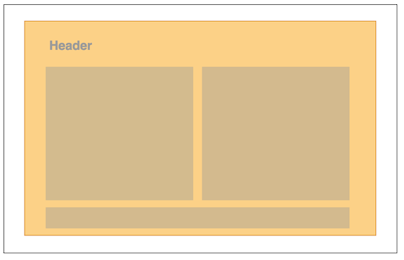

# GPS 2.1 Reflection

## Our wireframe

## Cheatsheet updated with CSS

## Did you feel more confident with CSS positioning?

I felt a bit more confident with CSS positioning, but still not 100%. We decided to use static positioning and floats to achieve our column separation and to position the Octocat image in our header. This also allowed our footer to flow naturally below the 2 columns so all we had to do was apply a bit of margin and center the text.

## How did you do with the learning competencies in general?

Overall, I feel I did very well by learning as much about CSS as I have in such a short time. Prior to last week, I had a very limited exposure to CSS and almost everything I knew about it was wrong. On the two occasions in which I previously experimented with CSS, I used a combination of styling in my HTML, lots of IDs, no Classes, and zero re-usability. Ugh!

Thanks to our work last week, I now have a much better understanding and appreciation for the value of: Atomic structure, class re-usability, and grids with media queries to enable responsive design. I also improved my understanding of; borders, margin and padding, float (and the importance of when to clear), and the positioning of elements. With respect to last week's solo challenge, I believe I did a reasonably good job of making my CSS Atomic and coming up with a bunch of re-usable classes. I also used one media query to adjust my website for smaller screens. While I did not feel I had the time to learn and create my own responsive grid last week, I look forward doing so when time allows.