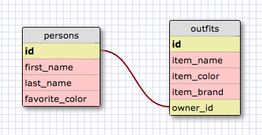

#8.4 Introduction to Database Schemas and SQL

## Release 4: Schema Design

### Play around with Schema Designer a bit to get used to it before moving on. Duplicate the states and regions tables above. Be sure to connect them properly!

## Release 5: SELECTing data from a database

### Create SQL Queries for the following: (Make sure all queries end with a semi-colon, if you forget, just enter it on the next line.)

####1. Select all data for all states.

	SELECT *
	FROM states;

####2. Select all data for all regions.

	SELECT *
	FROM regions;

####3. Select the state_name and population for all states.

	SELECT state_name, population
	FROM states;

####4. Select the state_name and population for all states ordered by population. The state with the highest population should be at the top.

	SELECT state_name, population
	FROM states
	ORDER BY population DESC;
   
####5. Select the state_name for the states in region 7.
   
	SELECT state_name
	FROM states
	WHERE region_id = 7;

####6. Select the state_name and population_density for states with a population density over 50 ordered from least to most dense.

	SELECT state_name, population_density
	FROM states
	WHERE population_density > 50
	ORDER BY population_density;
	
####7. Select the state_name for states with a population between 1 million and 1.5 million people.

	SELECT state_name
	FROM states
	WHERE population >= 1000000
	AND population <= 1500000;
	
####8. Select the state_name and region_id for states ordered by region in ascending order.

	SELECT state_name, region_id
	FROM states
	ORDER BY region_id;
	
####9. Select the region_name for the regions with "Central" in the name.

	SELECT region_name
	FROM regions
	WHERE region_name LIKE '%Central%'
	
####10. Select the region_name and the state_name for all states and regions in ascending order by region_id. Refer to the region by name. (This will involve joining the tables).

	SELECT region_name, state_name
	FROM regions, states
	WHERE regions.id = states.region_id
	ORDER BY regions.id;
	
## Release 6: Your Own Schema

###Make a simple schema design in Schema Designer to include a persons and outfits table. Be sure to connect them. Create at least 4 columns (with general types) for each table. One of the fields in the outfits table should refer to the id in the persons table. Reference the conventions file to read about database naming conventions. 

## Release 7: Reflect

####What are databases for?

Databases are software systems for storing, retrieving, and manipulating collections of data. Most commercial databases today are based on tables and rows of data that are connected by their relationships. These are called relational databases.

####What is a one-to-many relationship?

A one-to-many relationship is that in which a single record (or row) of one table in a relational database can relate directly to multiple rows of another table. A common example of this would be customers and orders. One customer can have zero to many orders but an order can only have one customer.

####What is a primary key? What is a foreign key? How can you determine which is which?

A primary key is a field (column) or group of fields in a relational database table for which each record (or row) will have a unique value. Good examples of primary keys include customer numbers, order numbers, and student IDs. Each table should have a single primary key and these are usually auto-indexed by the database management system.

A foreign key is a field (column) or group of fields in a relational database (child) table that relates directly to the primary key of another (parent) table. In this way the foreign key column is limited to those values that occur within the primary key column of the parent table. Each table may have more than one foreign key and they are normally not auto-indexed.

####How can you select information out of a SQL database? What are some general guidelines for that?

One selects information from an SQL database by issuing SQL (Structured Query Language) statements (or queries). SQL keywords are typically issued in uppercase, while column, table names, etc are entered in lowercase. Single quotes are also used instead of double quotes.

Based on what we have learned so far, these SQL queries generally include the keyword SELECT, followed by one or more column names, and then the keyword FROM, followed by the name of the table to be selected from. It is also possible to use the keyword WHERE followed by a conditional statement such as user_id < 200 or title = 'Game of Thrones' plus any number of AND/OR statements to chain conditionals. These results can also be sorted using the keywords ORDER BY followed by the name of the column to sort on.

